 

  

  <h3 align="center">Dentor</h3>

  

    Time and Patient management for dentists
     
     
  

## Table Of Contents

* [About the Project](#about-the-project)
* [Built With](#built-with)
* [Showcase](#showcase)
* [Authors](#authors)

## About The Project

Dentists working as sole proprietors need to keep records of patients and their schedules. But there are no simple and inexpensive solutions on the market. That's why the Dentor was invented. The purpose of the application is to make it possible to quickly create a record and have a convenient tool for working with patient data

Features:

* Timetable for all your appointments
* Cards for each patient. Store patient visits, services provided and their cost
* Offline mode
* Synchronization between all your devices
* Import and export appointments from built-in calendar or file

Introductory Walkthroughs will help you figure out the application

## Built With

Swift, SwiftUI, AWS Amplify, Appodeal, Apphud, Firebase Analytics

## Showcase
### Screenshots from Apple Store

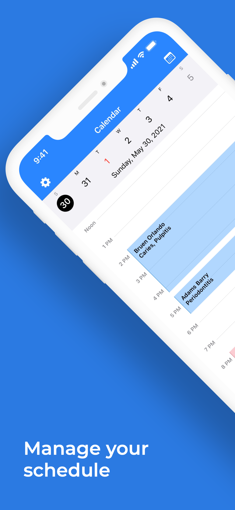
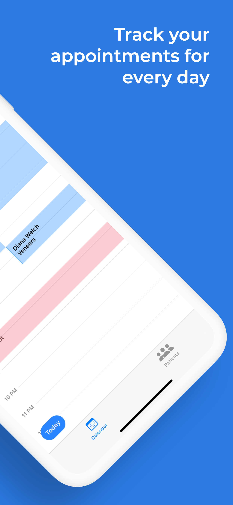
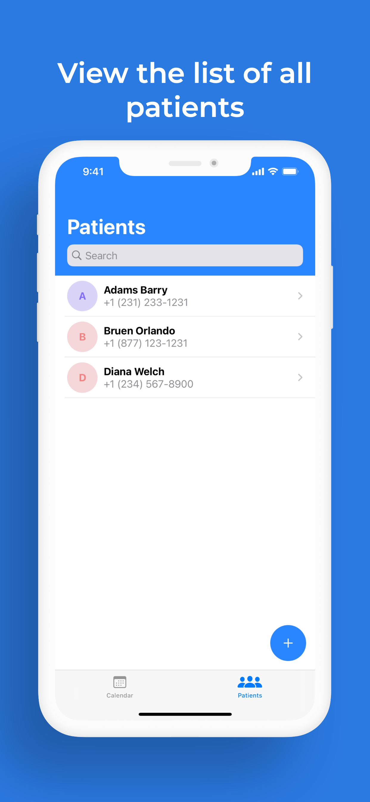
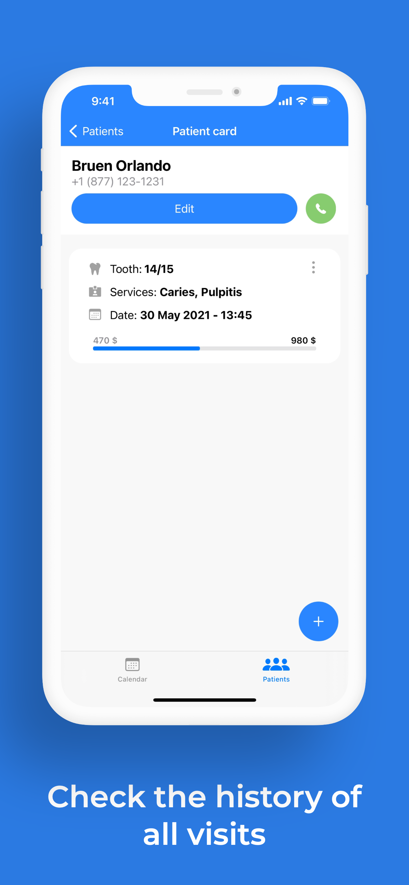
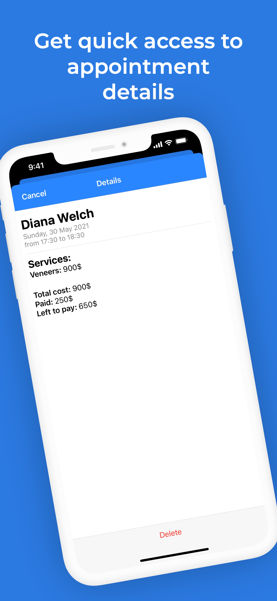
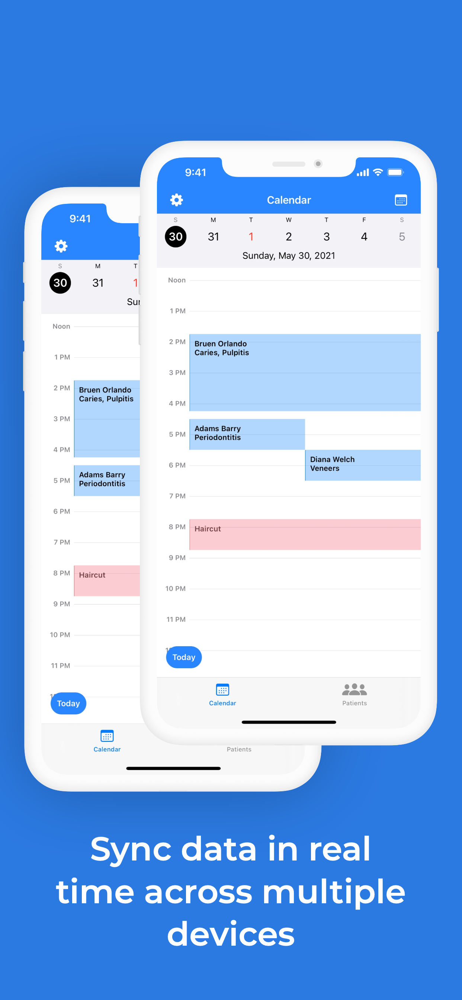
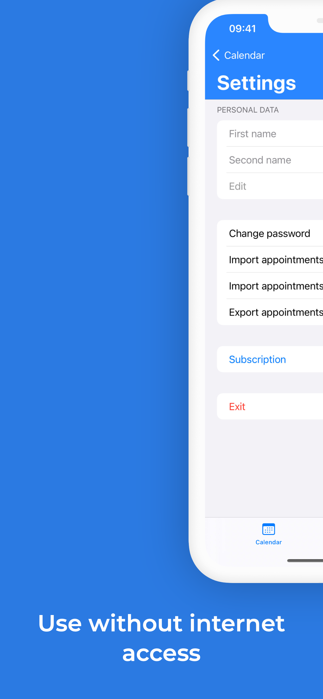
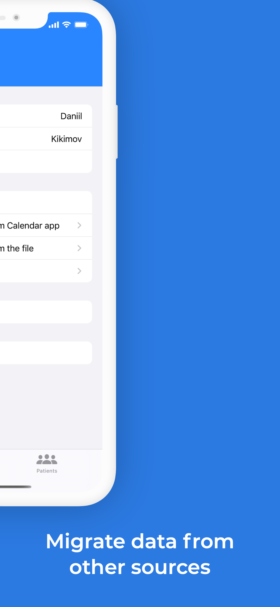

### Walkthrough gifs

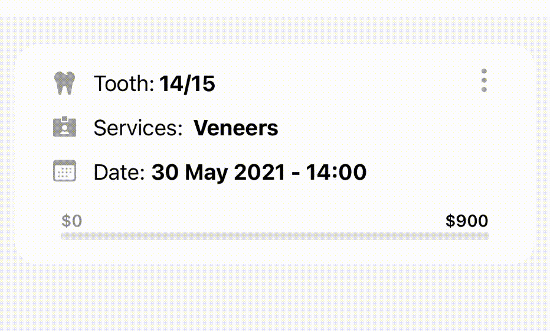

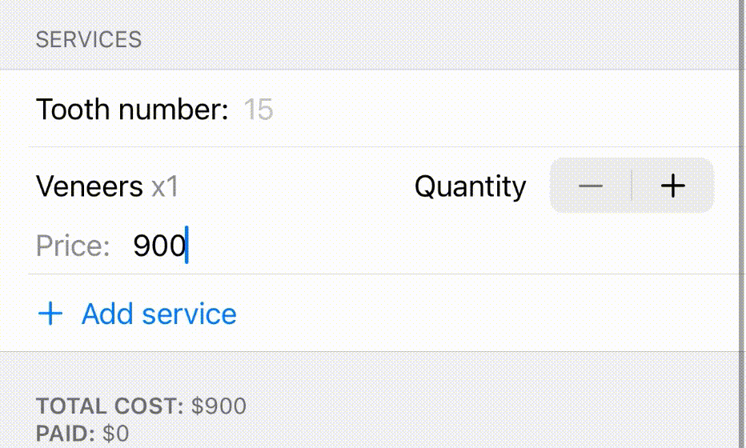

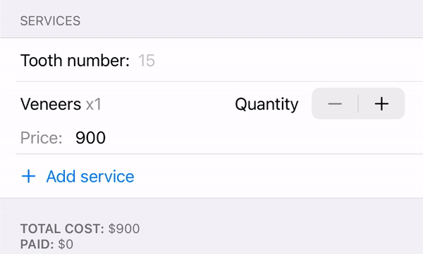

## Authors

* [Kikimov Daniil](https://github.com/dkikimov/)
